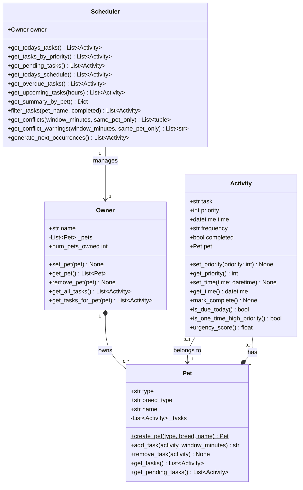

# PawPal+ — Final Class Diagram

Render this diagram at [mermaid.live](https://mermaid.live) or in any Markdown viewer with Mermaid support.

## Changes from initial design

| Initial | Final | Reason |
|---|---|---|
| `Activity.time: str` | `Activity.time: datetime` | Enables sorting and arithmetic (`timedelta`) without parsing |
| No `frequency` field | `Activity.frequency: str` | Required for recurring task logic |
| No `completed` field | `Activity.completed: bool` | Needed to track done/pending state |
| `Activity.mark_complete()` sets a flag | Also auto-schedules next occurrence | Recurrence logic belongs on the task itself |
| `Owner` held a flat `_tasks` list | Removed — tasks live on `Pet` | Avoids duplication; `get_all_tasks()` aggregates across pets |
| No `Scheduler` class | `Scheduler` added | Keeps sort/filter/conflict logic out of data classes and UI |
| No conflict detection | `get_conflicts()` + `get_conflict_warnings()` | Pet owners need to know when they've double-booked a pet |
| No `filter_tasks()` | `Scheduler.filter_tasks(pet_name, completed)` | UI needs composable filtering without duplicating logic |
